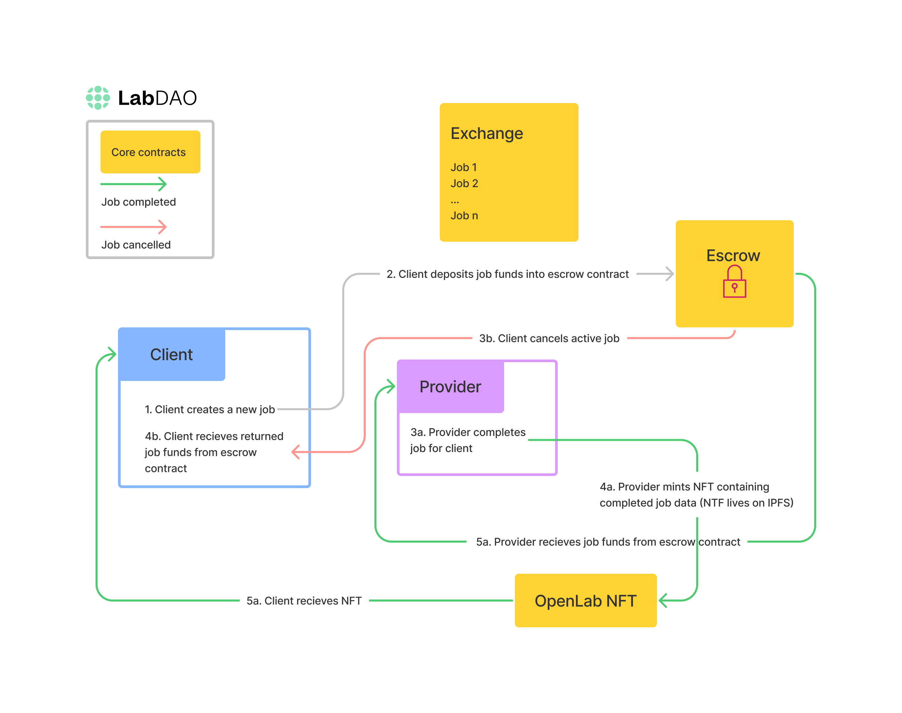

# OpenLab Smart Contracts

**Note:** WIP.

Deployed contracts on Polygon Mumbai Testnet (as of 15 Apr 2022)
* [ExchangeFactory](https://mumbai.polygonscan.com/address/0x53Eb5C8EF42D7261C0C2c9B8cF637a13B04f860A#code)
* [Exchange](https://mumbai.polygonscan.com/address/0xfee53bffb6b70593478cd027cb2b52776fd8c064#contracts)
* [OpenLabNFT](https://mumbai.polygonscan.com/address/0x29bdc464C50F7680259242E5E2F68ab1FC75C964#contracts)

## Contract Descriptions

WIP graphic to be updated

### Exchange.sol

The OpenLab exchange is the core of where Web3 transactions will be managed. Each Job has a **client, provider, payable ERC20 token, job cost, job URI (job metadata on IPFS), status, and NFT token URI (job completion metadata on IPFS)**.

Jobs can be created, activated, closed, and cancelled on the Exchange.
* Created - Clients initially create an open job. The client sets the payable ERC20 token and the job cost they are willing to accept. Jobs in the 'open' state do not yet have a Provider and can be cancelled; in this case, the client will receive 98% of their initial deposit with the remaining 2% would go to the Exchange creator.
* Activated - A validated Provider may accept 'open' jobs. When a Job has been accepted, the Client no longer has the option to cancel the Job and must wait until the Provider completes the Job.
* Closed - A completed Job is in the 'closed' state. At this point, the Provider has completed the work, and a swap of an ERC721 token with the job completion metadata and the deposited job funds has occurred between client and provider. 
* Cancelled - A Job which was not completed by a Provider.

### OpenLabNFT.sol

The OpenLabNFT contract is our ERC721 token which gets transferred upon completion of a job. Checks that both the provider and client are validated addresses per Exchange.sol, and mints an OpenLab NFT (OLNFT).

## In Progress

* Happy path testing of contracts
* The Graph subgraphs for Mumbai testnet contracts
* Polygon mainnet deployment